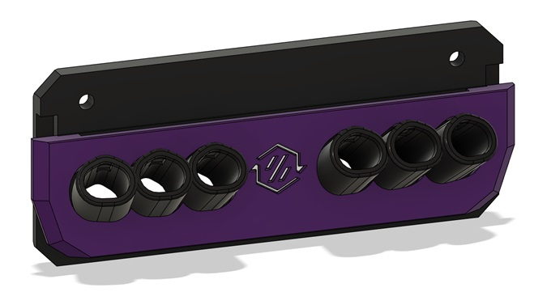

# Umbilical Restraints
There are 2 different ports for the umbilical plates.
- TPU - Uses a TPU printed relief.
- THREADED - Uses either M12x1.5 or PG7 cable glands.

There are 2 supported methods of taming the umbilical.
- Flat Spring Steel - 0.3x3mm (preferred) [Link](https://www.aliexpress.com/item/1005006731615186.html "Aliexpress")
- Piano Wire - 1mm

Select the TPU configuration for your printer and umbilical cable diameter.
##### Spring
- [Voron 3.7mm cable](STL/TPU%20Umbilical/Voron/Spring/3.7mm%20Cable)
- [Voron 4mm cable](STL/TPU%20Umbilical/Voron/Spring/4mm%20Cable)
- [Voron 4.5mm cable](STL/TPU%20Umbilical/Voron/Spring/4.5mm%20Cable)
- [Voron 5mm cable](STL/TPU%20Umbilical/Voron/Spring/5mm%20Cable)
- [Voron 5.5mm cable](STL/TPU%20Umbilical/Voron/Spring/5.5mm%20Cable)
- [Voron 6mm cable](STL/TPU%20Umbilical/Voron/Spring/6mm%20Cable)
- [Voron 6.35mm cable](STL/TPU%20Umbilical/Voron/Spring/6.35mm%20Cable)
- [Micron 3.7mm cable](STL/TPU%20Umbilical/Micron/Spring/3.7mm%20Cable)
- [Micron 4mm cable](STL/TPU%20Umbilical/Micron/Spring/4mm%20Cable)
- [Micron 4.5mm cable](STL/TPU%20Umbilical/Micron/Spring/4.5mm%20Cable)
- [Micron 5mm cable](STL/TPU%20Umbilical/Micron/Spring/5mm%20Cable)
- [Micron 5.5mm cable](STL/TPU%20Umbilical/Micron/Spring/5.5mm%20Cable)
- [Micron 6mm cable](STL/TPU%20Umbilical/Micron/Spring/6mm%20Cable)
- [Micron 6.35mm cable](STL/TPU%20Umbilical/Micron/Spring/6.35mm%20Cable)
##### Wire
- [Voron 3.7mm cable](STL/TPU%20Umbilical/Voron/Wire/3.7mm%20Cable)
- [Voron 4mm cable](STL/TPU%20Umbilical/Voron/Wire/4mm%20Cable)
- [Voron 4.5mm cable](STL/TPU%20Umbilical/Voron/Wire/4.5mm%20Cable)
- [Voron 5mm cable](STL/TPU%20Umbilical/Voron/Wire/5mm%20Cable)
- [Voron 5.5mm cable](STL/TPU%20Umbilical/Voron/Wire/5.5mm%20Cable)
- [Voron 6mm cable](STL/TPU%20Umbilical/Voron/Wire/6mm%20Cable)
- [Voron 6.35mm cable](STL/TPU%20Umbilical/Voron/Wire/6.35mm%20Cable)
- [Micron 3.7mm cable](STL/TPU%20Umbilical/Micron/Wire/3.7mm%20Cable)
- [Micron 4mm cable](STL/TPU%20Umbilical/Micron/Wire/4mm%20Cable)
- [Micron 4.5mm cable](STL/TPU%20Umbilical/Micron/Wire/4.5mm%20Cable)
- [Micron 5mm cable](STL/TPU%20Umbilical/Micron/Wire/5mm%20Cable)
- [Micron 5.5mm cable](STL/TPU%20Umbilical/Micron/Wire/5.5mm%20Cable)
- [Micron 6mm cable](STL/TPU%20Umbilical/Micron/Wire/6mm%20Cable)
- [Micron 6.35mm cable](STL/TPU%20Umbilical/Micron/Wire/6.35mm%20Cable)

 There is also a TPU plug to block ports for upcoming additional tools. [Link](STL/TPU%20Umbilical/Relief_Plug.stl, "TPU Plug")
## Methodology
You need to print 1 Relief, 1 Terminator and enough Clips to keep your umbilical tidy (typically 4-6) per tool.
The spring steel/piano wire length should be the diagonal length of your bed + enough material for bending (~25mm). This is a good starting point for Voron printers.
### Spring Steel
Spring steel can snap rather easily when bending. Before bending heat the area with a blow torch or lighter to a cherry red and let it cool. This makes the steel more ductile and will bend without snapping.
If there is too much friction while feeding the spring steel you can add a dab of dish washing liquid as a lubricant.
 Insert the spring steel through the strain relief and out the back. Bend it 180 degrees 12mm from the end.
 
 Do a second bend at ~60 degrees 6mm from the end that was bent in the previous step.
 
 
 Feed the spring steel through all of the clips matching the hole orientation to the strain relief. 
 Feed the spring steel through the terminator and do 2 bends at ~30 degrees. Feed the spring steel back until the bend is inside the slot for the spring steel.  
 Mount the bowden tube and cable in the strain relief and inset the strain relief into the plate. This is the time to determine the length you need. With the strain relief inserted in the back plate, run your cable to the tool while it is at the largest travel position for that specific tool. For instance, T0 would be at MAX_X and MIN_Y, The last tool would be at MIN_X and MIN_Y. Make sure that at that position there is minimal slack, but there should be some. You do not want the umbilical to be putting strain on the toolhead. Then work your way back from the toolhead and insert the bowden tube and cable into the termination print, and then the clips (which can be spaced evenly). If at any point there is too little or too much slack, pull out the strain relief and adjust it.

 Optionally you can add some heat shrink (with glue) to keep the clips from moving. 
### Piano Wire
The procedure for piano wire is much the same as spring steel except the wire gets 2 90 degree bends at the Relief and Terminator.

___
# Umbilical Plate
To choose the appropriate umbilical plate for your setup there are 6 things to consider.
- The type of printer you have, Typically Voron.
- The size of the printer.
- The amount of tools you want to support.
- The type of umbilical you are using, TPU or Threaded.
- The width of the docks for the tools you are using.
- How the docks are positioned on the printer, Left, Right, Centered or Split.

The Modular Docks can have 2 different widths. Make sure to select the appropriate width for the type of tool you are using.

**60mm Wide Docks**
- Anthead
- Dragon Burner
- Mini StealthBurner
- Yavoth

**76mm Wide Docks**
- A4T
- Archetype Blackbird
- StealthBurner
- XOL

Select the appropriate umbilical plate configuration from the below tables.

<strong>Voron 250mm TPU 60mm Wide Dock</strong>

### Voron 250mm TPU 60mm Wide Dock
| Tool Count | Left | Right | Center | Split |
|-|-|-|-|-|
| 2 | | | | |
| 3 | - | - | | |
| 4 | - | - | | |
| 5 | - | - | - | |

<strong>Voron 250mm TPU 76mm Wide Dock</strong>

### Voron 250mm TPU 76mm Wide Dock
| Tool Count | Left | Right | Center | Split |
|-|-|-|-|-|
| 2 | | | | |
| 3 | - | - | | |
| 4 | - | - | - | |

<strong>Voron 250mm Threaded 60mm Wide Dock</strong>

### Voron 250mm Threaded 60mm Wide Dock
| Tool Count | Left | Right | Center | Split |
|-|-|-|-|-|
| 2 | | | | |
| 3 | - | - | | |
| 4 | - | - | | |
| 5 | - | - | - | |

<strong>Voron 250mm Threaded 76mm Wide Dock</strong>

### Voron 250mm Threaded 76mm Wide Dock
| Tool Count | Left | Right | Center | Split |
|-|-|-|-|-|
| 2 | | | | |
| 3 | - | - | | |
| 4 | - | - | - | |

<strong>Voron 300mm TPU 60mm Wide Dock</strong>

### Voron 300mm TPU 60mm Wide Dock
| Tool Count | Left | Right | Center | Split |
|-|-|-|-|-|
| 2 | | | | |
| 3 | | | | |
| 4 | - | - | | |
| 5 | - | - | | |
| 6 | - | - | - | |

<strong>Voron 300mm TPU 76mm Wide Dock</strong>

### Voron 300mm TPU 76mm Wide Dock
| Tool Count | Left | Right | Center | Split |
|-|-|-|-|-|
| 2 | | | | |
| 3 | - | - | | |
| 4 | - | - | - | |

<strong>Voron 300mm Threaded 60mm Wide Dock</strong>

### Voron 300mm Threaded 60mm Wide Dock
| Tool Count | Left | Right | Center | Split |
|-|-|-|-|-|
| 2 | | | | |
| 3 | | | | |
| 4 | - | - | | |
| 5 | - | - | | |
| 6 | - | - | - | |

<strong>Voron 300mm Threaded 76mm Wide Dock</strong>

### Voron 300mm Threaded 76mm Wide Dock
| Tool Count | Left | Right | Center | Split |
|-|-|-|-|-|
| 2 | | | | |
| 3 | - | - | | |
| 4 | - | - | - | |

<strong>Voron 350mm TPU 60mm Wide Dock</strong>

### Voron 350mm TPU 60mm Wide Dock
| Tool Count | Left | Right | Center | Split |
|-|-|-|-|-|
| 2 | | | | |
| 3 | | | | |
| 4 | - | - | | |
| 5 | - | - | | |
| 6 | - | - | - | |

<strong>Voron 350mm TPU 76mm Wide Dock</strong>

### Voron 350mm TPU 76mm Wide Dock
| Tool Count | Left | Right | Center | Split |
|-|-|-|-|-|
| 2 | | | | |
| 3 | - | - | | |
| 4 | - | - | | |
| 5 | - | - | - | |

<strong>Voron 350mm Threaded 60mm Wide Dock</strong>

### Voron 350mm Threaded 60mm Wide Dock
| Tool Count | Left | Right | Center | Split |
|-|-|-|-|-|
| 2 | | | | |
| 3 | | | | |
| 4 | - | - | | |
| 5 | - | - | | |
| 6 | - | - | - | |

<strong>Voron 350mm Threaded 76mm Wide Dock</strong>

### Voron 350mm Threaded 76mm Wide Dock
| Tool Count | Left | Right | Center | Split |
|-|-|-|-|-|
| 2 | | | | |
| 3 | - | - | | |
| 4 | - | - | | |
| 5 | - | - | - | |

<strong>Micron 180mm TPU 60mm Wide Dock</strong>

### Micron 180mm TPU 60mm Wide Dock
| Tool Count | Left | Right | Center | Split |
|-|-|-|-|-|
| 2 | | | | |
| 3 | - | - | | |
| 4 | - | - | - | |

## Methodology
 
# TODO
___
Credits goto
- [viesturz](https://github.com/viesturz) for the Tapchanger TPU umbilicals, which were the inspiration for this system.
- [hartk1213](https://github.com/hartk1213) as the umbilical plate aesthetics were recreated based on his Micron R1 exhaust plate.